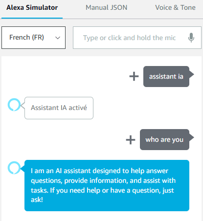

# Alexa Assistant IA

Boost your Alexa by making it respond as any IA Chat.

This repository contains a tutorial on how to create a simple Alexa skill that uses the IA Chat to generate responses.

It support multiple APIs:
    [x] GitHub copilot (token with `models:read` permission)
    [x] ChatGpt
    [x] Claude

It support multipls languages:
    [x] English
    [x] French
    [ ] ...

  

## Prerequisites

- An [Amazon Developer account](https://developer.amazon.com/)

- An account to any IA model:
    [x] GitHub copilot (token with `models:read` permission)
    [x] ChatGpt
    [x] Claude

## Step-by-step tutorial

### 1. 
Log in to your Amazon Developer account and navigate to the [Alexa Developer Console](https://developer.amazon.com/alexa/console/ask).

### 2.
Click on "Create Skill" and name the skill "IA Assistant". Choose the primary locale according to your language.

### 3.
Choose "Other" and "Custom" for the model.

### 4.
Choose "Alexa-hosted (Python)" for the backend resources.

### 5.
- Click on "Import Skill", paste the link of this repository (https://github.com/o0zz/alexa-assistant-ia.git) and click on "Import".

### 6.
In the "Build" section, navigate to the "JSON Editor" tab.

### 7.
Just change the "invocationName" to "ia assistant" or another preferred word for activation.

### 8.
Edit config.py file and Update

- `AGENT`: your agent and its token
- `ENABLE_FOLLOWUP_SUGGESTIONS`: If you want to enable suggestions

### 9.
Save and deploy. Go to "Test" section and enable "Skill testing" in "Development".

### 10.
You are now ready to use your Alexa in IA Assistant mode. You should see results like this:

Please note that running this skill can incur costs for both AWS Lambda and Models usage once you move beyond free limits. 
Make sure you understand the pricing structure and monitor your usage to avoid unexpected charges.

## Note

This project has been strongly inspired by https://github.com/k4l1sh/alexa-gpt